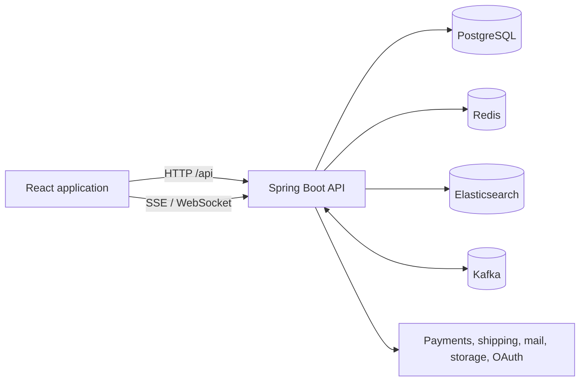

# ShopWave

ShopWave is a full-stack, multi-vendor commerce platform. It combines a React storefront and merchant workspace with a Spring Boot API for catalog, checkout, fulfillment, subscriptions, loyalty, marketing, support, and marketplace operations.

The repository is under active development. The documentation describes behavior present in the current codebase; see the [candidate roadmap](documentation/roadmap.md) for ideas that are not commitments.

## Highlights

- Marketplace browsing, product comparison, collections, kits, saved lists, reviews, Q&A, and price watches
- Customer orders, delivery slots, shipping rates, pickup, tracking, returns, subscriptions, gift cards, and loyalty
- Merchant catalog, inventory, purchasing, fulfillment, B2B quotes, promotions, marketing, webhooks, reports, and team management
- JWT authentication with refresh-token cookies, OAuth integrations, rate limits, device verification, and risk checks
- PostgreSQL persistence managed by Flyway, Redis caching and coordination, Elasticsearch search, and Kafka events
- Backend unit and Testcontainers integration tests, frontend Vitest tests, and Playwright browser smoke tests

## Technology

| Area               | Stack                                                                                         |
| ------------------ | --------------------------------------------------------------------------------------------- |
| Frontend           | React 19, TypeScript 5.8, Vite 6, React Router, Redux Toolkit, TanStack Query, Tailwind CSS 4 |
| Backend            | Java 21, Spring Boot 3.4, Spring Security, Spring Data JPA, Maven                             |
| Data and messaging | PostgreSQL 16, Redis 7, Elasticsearch 8, Kafka 4, Flyway                                      |
| Integrations       | Stripe, S3-compatible storage, EasyPost, AfterShip, SMTP, OAuth, Firebase, Twilio             |
| Tests              | JUnit, Mockito, Testcontainers, JaCoCo, Vitest, Testing Library, Playwright                   |

## Architecture



See the [architecture guide](documentation/architecture.md) for component responsibilities and consistency boundaries.

## Quick Start with Docker

Prerequisites: Docker Desktop or Docker Engine with Compose, Git, and enough memory for PostgreSQL, Redis, Elasticsearch, Kafka, the backend, and the frontend.

```powershell
Copy-Item .env.example .env
docker compose up --build
```

On macOS or Linux, use `cp .env.example .env` for the first command.

Once the health checks settle, open:

| Service       | URL                                |
| ------------- | ---------------------------------- |
| Frontend      | <http://localhost:3000>            |
| Backend API   | <http://localhost:8090/api>        |
| Health check  | <http://localhost:8090/api/health> |
| PostgreSQL    | `localhost:5433`                   |
| Redis         | `localhost:6379`                   |
| Elasticsearch | <http://localhost:9200>            |
| Kafka         | `localhost:9093`                   |

The ports above assume the checked-in `.env.example` was copied to `.env`. Compose has its own fallback ports when no `.env` file is present; the [configuration guide](documentation/configuration.md) explains both.

The default `dev` profile seeds local-only accounts. All use the password `Password123!`:

| Role          | Email                        |
| ------------- | ---------------------------- |
| Administrator | `admin@shopwave.dev`         |
| Merchant      | `merchant.tech@shopwave.dev` |
| Customer      | `alice@example.com`          |

Additional merchant and customer accounts are listed in the [getting-started guide](documentation/getting-started.md). Never use these credentials outside local development.

Stop the stack with `docker compose down`. To also delete local data and start from a clean database, use `docker compose down -v`.

## Development Commands

```powershell
# Frontend development server (http://localhost:3090)
Set-Location frontend
npm ci
npm run dev

# Backend (run in a second terminal from backend/)
.\mvnw.cmd spring-boot:run
```

For local application processes, start infrastructure first with:

```powershell
docker compose up -d postgres redis elasticsearch kafka
```

Common checks:

```powershell
# Frontend
Set-Location frontend
npm run lint
npm run build
npm run test -- --run

# Backend unit suite
Set-Location ../backend
.\mvnw.cmd verify "-Dtest=**/*Test" "-Dspring-boot.repackage.skip=true"
```

On macOS or Linux, use `./mvnw` in place of `.\mvnw.cmd`.

See [testing](documentation/testing.md) for integration and browser-test commands.

## Documentation

- [Contributor handbook](documentation/README.md)
- [Getting started](documentation/getting-started.md)
- [Architecture](documentation/architecture.md)
- [Domain guide](documentation/domain-guide.md)
- [API guide](documentation/api-guide.md)
- [Configuration](documentation/configuration.md)
- [Testing](documentation/testing.md)
- [Operations](documentation/operations.md)
- [Candidate roadmap](documentation/roadmap.md)

The older `docs/` directory is an ignored local planning archive and is not the source of truth for the running application.

## Community and Policies

- [Contributing](CONTRIBUTING.md)
- [Code of Conduct](CODE_OF_CONDUCT.md)
- [Support](SUPPORT.md)
- [Security policy](SECURITY.md)
- [MIT License](LICENSE)
