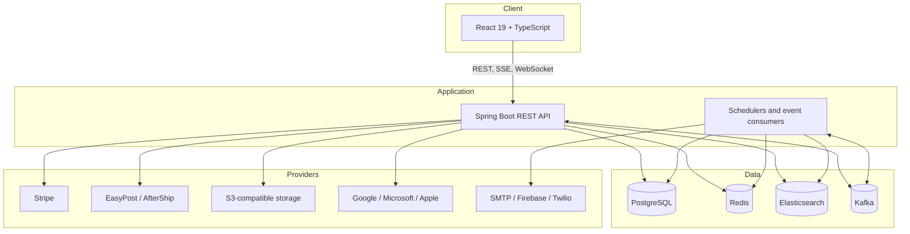

# Architecture

ShopWave is a modular monolith with a separate browser application. Business domains share one Spring Boot process and PostgreSQL schema, while Redis, Elasticsearch, and Kafka provide specialized infrastructure.

## System View

## Frontend

`frontend/src/App.tsx` defines public and protected routes. Pages compose domain components, call the modules under `frontend/src/api`, validate forms with Zod and React Hook Form, and use TanStack Query for server state. Redux slices hold cross-cutting client state such as authentication, cart, marketplace, vendor, and loyalty context.

Vite serves local development on port `3090` and proxies `/api` to the backend. The production container builds static assets and serves them through Nginx, which proxies API traffic to the backend container.

## Backend

The backend follows controller → service → repository boundaries:

- Controllers under `backend/controllers/impl` own HTTP mapping and input validation.
- Services under `backend/services` enforce business rules and transaction boundaries.
- Repositories persist JPA models to PostgreSQL.
- DTOs form the HTTP contract; controllers should not expose JPA entities.
- Cross-cutting packages provide security, retry, caching, validation, logging, and response wrapping.

The servlet context path is `/api`, so a controller mapping such as `/orders` is served at `/api/orders`.

## Data Responsibilities

### PostgreSQL and Flyway

PostgreSQL is the source of truth for users, products, inventory, orders, payments, and other business state. Flyway migrations in `backend/src/main/resources/db/migration` own the schema. Hibernate validates mappings at startup and must not create or update tables.

Order and inventory paths favor consistency. Mutations use transactions, entity versions or database locks, idempotency mechanisms, and compensating behavior where an external payment or fulfillment step can fail.

### Redis

Redis is used for caches, rate limits, short-lived reservations, distributed locks, and coordination. It is not the source of truth for inventory or orders. Write paths must retain database correctness when cached data is absent or stale.

### Elasticsearch

Elasticsearch serves catalog search and suggestions. Indexing is asynchronous and can lag behind PostgreSQL briefly. Index configuration supports bounded workers, retry processing, and versioned aliases.

### Kafka

Kafka carries activity, product, bundle, email, import, loyalty, fulfillment, announcement, notification, and outbound-webhook events. Topic names are configured centrally in `application.properties`. Consumers must be idempotent, and several flows provide dead-letter topics for failed work.

## Consistency Boundaries

| Concern                     | Strategy                                                                                          |
| --------------------------- | ------------------------------------------------------------------------------------------------- |
| Checkout, orders, inventory | PostgreSQL transactions and locking; revalidate stock at mutation time                            |
| Catalog reads               | Cache-aside and search indexes; brief staleness is acceptable                                     |
| Search                      | PostgreSQL is authoritative; Elasticsearch is a read projection                                   |
| Notifications and activity  | Asynchronous Kafka processing; retries and dead-letter handling                                   |
| External providers          | Timeouts, retries, circuit breakers, idempotency, or compensating actions according to the domain |

## Authentication and Authorization

Successful authentication returns a short-lived access token for the `Authorization: Bearer` header and uses an HttpOnly refresh-token cookie. The Spring Security filter parses JWTs, while domain annotations and method security enforce access rules. The global HTTP rule permits requests through so controller/service-level policies and public endpoints can coexist.

OAuth verification supports Google, Microsoft, and Apple configuration. Authentication also includes configurable rate limits, login lockout, device verification, password hashing, captcha verification, and optional risk step-up flows.

## Runtime Profiles and Seed Data

`SPRING_PROFILES_ACTIVE` defaults to `dev`. Components annotated with `@Profile("dev")` seed demonstration data in that profile. A deployment must set its intended profile explicitly and provide production secrets; it must not rely on local defaults.

## Design Constraints

- Add schema changes through a new Flyway migration; never edit an applied migration.
- Keep controllers thin and map entities to DTOs.
- Keep server state in TanStack Query rather than duplicating it into component state.
- Preserve idempotency for retried commands and event consumers.
- Treat Redis, Elasticsearch, and Kafka as supporting systems rather than replacements for PostgreSQL business state.
- Respect reduced-motion preferences and the established dark visual language in frontend work.
